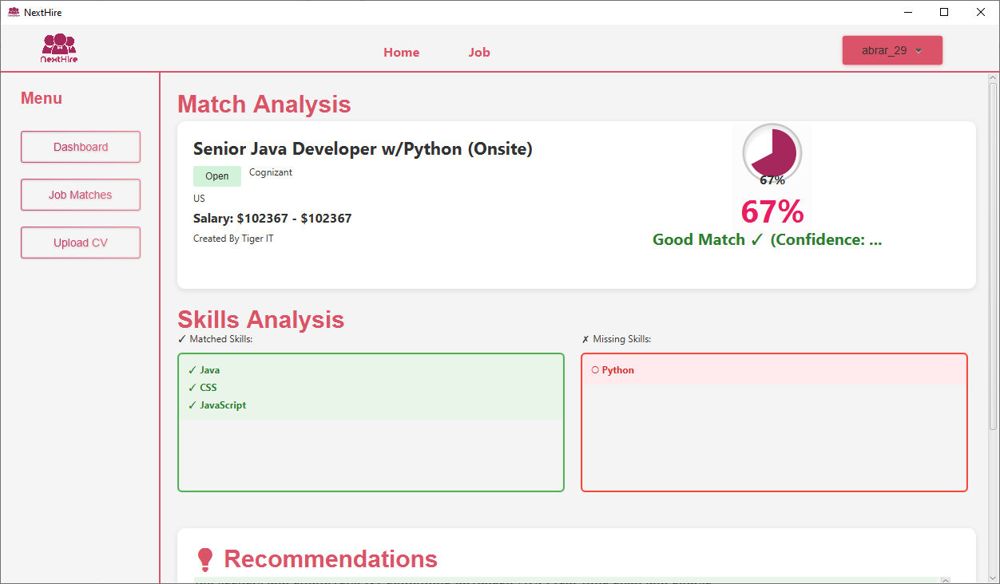
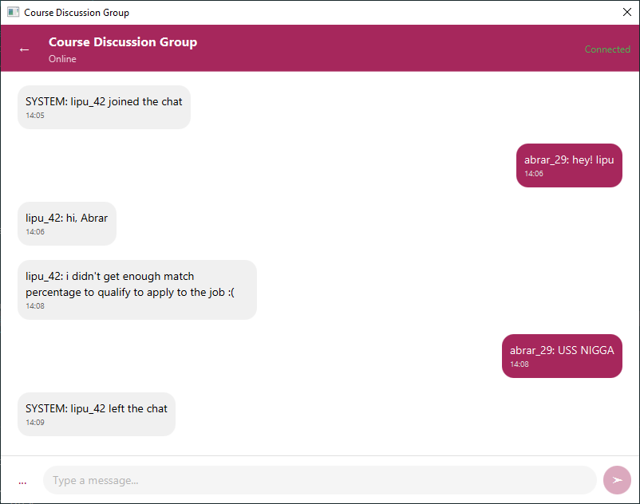

# 🚀 NextHire – Resume Analyzer & Job Matcher

---

**NextHire** is a cutting-edge desktop application built with JavaFX that revolutionizes the recruitment process for both job seekers and employers. Effortlessly analyze your resume, match it against live job postings, receive actionable feedback, and connect with others - **all in one app**!

---

## ⚡️ Features

### 📄 Resume Upload & Parsing
- **Upload resumes** in PDF formats
- Automatic extraction of **skills, education, and work experience**
- Powered by **Apache PDFBox** and **Apache POI**

### 🤖 Intelligent Job Matching
- Enhanced **NLP-based** job matching via **Apache OpenNLP**
- Multi-factor scoring: skill match, keyword importance, experience, and context
- Visualize match percentage and strengths/weaknesses

### 🌐 Job Database & API Integration
- Matches against **local database jobs** & external APIs (**e.g., Adzuna**)
- Instantly view matching jobs, requirements, and match percentages

### 📊 Match Visualization & Feedback
- See match scores on real-time charts (**JavaFX Charts**)
- Get personalized recommendations and feedback to boost alignment

### 🎓 Course Recommendations
- Get relevant course suggestions if match is low
- View course details & watch learning videos within the app

### 💬 Real-Time Chat System
- Modern built-in chat using **Java Sockets** & multithreading
- Responsive, persists messages, and enables user-to-user conversations

### 🔒 User Management
- Secure sign up, login, and password reset with database-backed credentials
- Robust user data & authentication flow

### 📁 Export & Reporting
- Export analysis and feedback reports as PDFs

---

## 🖼️ UI Snapshots

- **Home Screen:** 
- **Login Screen:** 
- **Sign Up Screen:** 
- **Forget Password:** 
- **Reset Password:** 
- **Job Dashboard:** 
- **Job Description:** 
- **Resume Upload / Eligibility Check:** 
- **Match Result:** 
- **Courses Page:** 
- **Course Description:** 
- **Course Video:** 
- **Chat UI:** 

---

## 🛠️ Tech Stack

- **Frontend:** JavaFX & FXML
- **Backend:** Java (OOP, multithreading, socket programming)
- **Document Parsing:** Apache PDFBox, Apache POI
- **NLP:** Apache OpenNLP
- **Database:** Local SQL DB & API integration
- **Visualization:** JavaFX Charts

---

## 📚 How to Run

1. Clone the repository: git clone https://github.com/Abrar-Labib-29/Project-NextHire.git
2. Open in your Java IDE (e.g., IntelliJ IDEA).
3. Ensure Java 11+ is installed.
4. Run the main class from your IDE.

---

## ✨ Contribution

Pull requests are welcome! For major changes, please open an issue first to discuss what you would like to change.

---

## 📄 License

This project is open-sourced under the MIT License.

---

> ✉️ For feedback and questions, reach me at abrar.labib2829@gmail.com  
